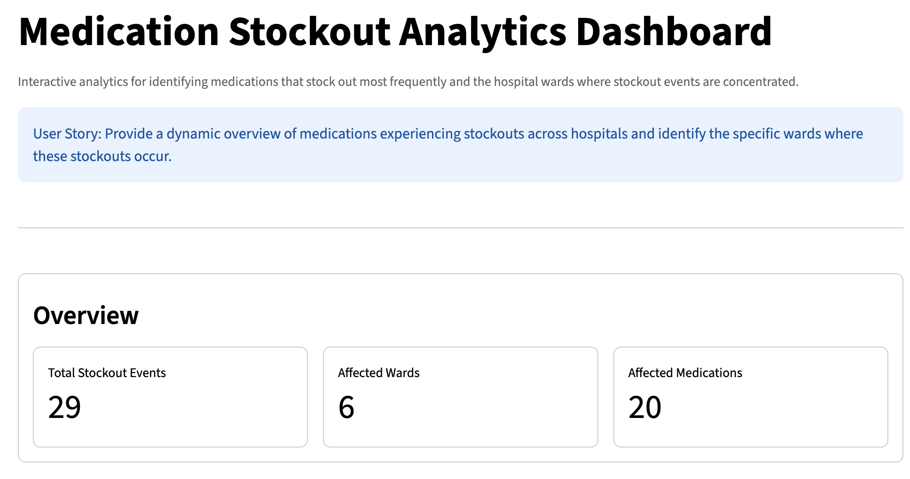
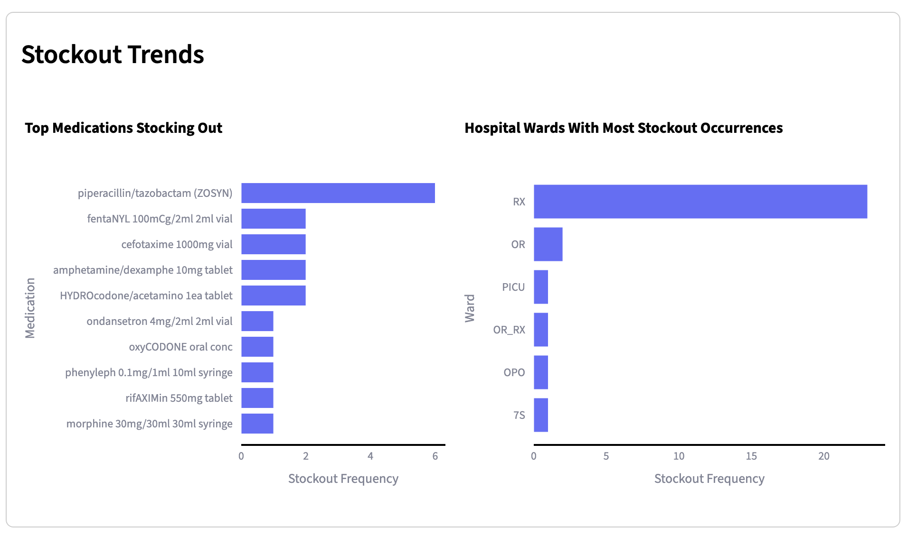
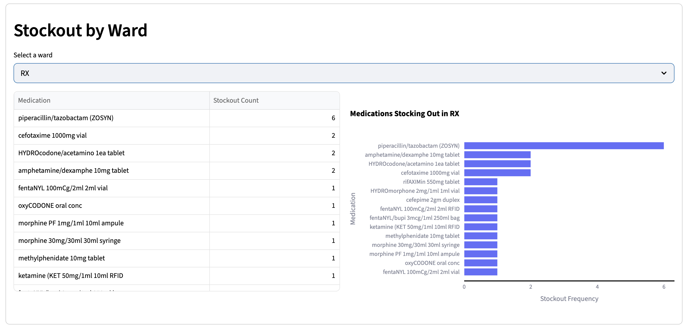

# Medication Stockout Analytics Dashboard

## Overview

Hospital medication stockouts can negatively impact patient care and hospital operations. This project provides an interactive analytics dashboard for identifying medications that are stocking out most frequently and the hospital wards where these stockouts occur.

The dashboard enables healthcare operations teams to quickly understand stockout patterns and investigate specific wards where medication availability issues arise.

This will reduce disruptions to patient care and support inventory decisions

---

## User Story

> Can we have a dynamic overview of the medications that are stocking out in our hospitals and know exactly which wards they are stocking out from?

This dashboard answers that question by providing:

- High-level metrics summarizing stockout events
- Visualization of the medications most frequently stocking out
- Visualization of wards experiencing the most stockout occurrences
- A drill-down explorer to inspect stockouts by individual ward

---

## Features

### Overview Metrics
Displays key indicators including:

- Total stockout events
- Number of affected hospital wards
- Number of affected medications

### Medication Stockout Analysis
Interactive chart showing medications with the highest stockout frequency.

### Ward Stockout Analysis
Chart highlighting hospital wards with the most stockout occurrences.

### Ward Explorer
Allows users to select a ward and view:

- Medications stocking out in that ward
- Frequency of those stockouts
- A visual bar chart for quick comparison

---

## Dashboard Preview

Example:


The dashboard allows the user to get a quick overview of the total stockout events, the number of wards that are affected and the number of medications affected.

---


The dashboard also allows the user get more information about the top ten (10) list of medications stocking out as well as the most prevalent wards in which stockouts are happening.

---


Finally, the dashboard provides a dynamic interaction where the user can drill down into any particular ward and see the actual medications stocking out and the frequency of such occurence in that ward.

---
Find the actual dashboard [here](https://medication-stockout-analytics-3fqbodsabtdpgshxowct2v.streamlit.app/)

---

## Project Architecture

```
medication-stockout-analytics/
│
├── app.py                  # Streamlit dashboard
│
├── data/
│   ├── raw/                # Anonymized source datasets
│   └── processed/          # Pipeline outputs
│
├── src/
│   ├── load_data.py        # Raw data ingestion
│   ├── transform.py        # Data standardization and joins
│   ├── stockout_logic.py   # Business logic for stockout analysis
│   ├── plots.py            # Visualization helper functions
│   └── pipeline.py         # Data pipeline orchestration
│
├── notebooks/
│   └── exploratory analysis notebooks
│
└── assets/
    └── screenshots/        # Dashboard screenshots for README
```

---

## Data Pipeline

The analytics pipeline performs the following steps:

1. Load anonymized hospital datasets
2. Standardize column names
3. Join relevant hospital, ward, medication, and transaction tables
4. Identify stockout events based on inventory levels
5. Filter out transaction types that do not represent true stockouts
6. Generate aggregated datasets for dashboard visualizations

Pipeline outputs include:

- `final_table.csv`
- `stockout_events.csv`
- `stockout_by_ward.csv`
- `top_medications.csv`
- `top_wards.csv`

---

## Technologies Used

- **Python**
- **Pandas** — data processing
- **Streamlit** — interactive dashboard
- **Plotly** — interactive visualizations

---

## Running the Project

### 1. Clone the repository

```bash
git clone https://github.com/toluwaniosabiya/medication-stockout-analytics.git
cd medication-stockout-analytics
```

### 2. Create a virtual environment

```bash
python -m venv venv
source venv/bin/activate
```

### 3. Install dependencies

```bash
pip install -r requirements.txt
```

### 4. Run the data pipeline

```bash
python -m src.pipeline
```

### 5. Launch the dashboard

```bash
streamlit run app.py
```

---

## Future Improvements

Potential enhancements for the dashboard include:

- Time-series analysis of stockout trends
- Alerts for high-risk medications
- Forecasting future stockout risk
- Integration with hospital inventory management systems
- Deployment to Streamlit Cloud or another cloud platform

---

## Author

**Toluwani Osabiya**

Data Scientist | Healthcare Analytics

---

## License

This project is provided for educational and portfolio purposes.